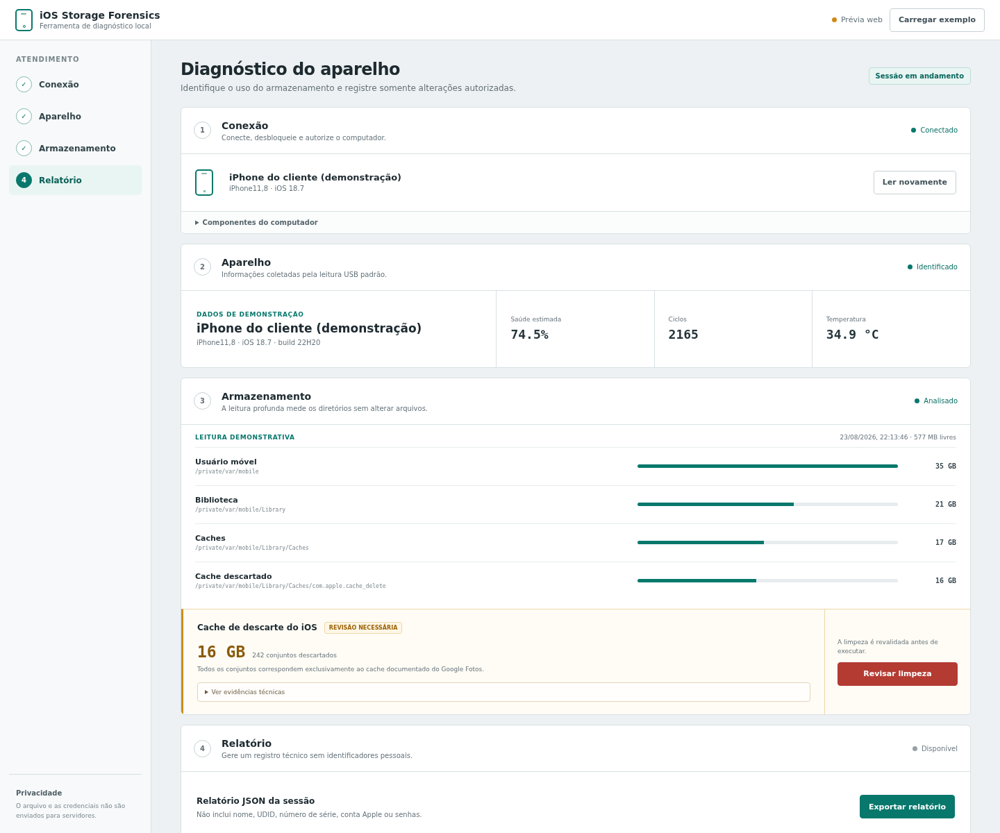

# iOS Storage Forensics

Um aplicativo para Windows que ajuda o técnico a descobrir o que está ocupando
o armazenamento de um iPhone **antes de apagar qualquer coisa**.



## Em poucas palavras

O programa organiza o atendimento em quatro etapas:

1. **Conexão:** reconhece o iPhone ligado pelo cabo USB;
2. **Aparelho:** mostra modelo, versão do iOS e os dados de bateria disponíveis;
3. **Armazenamento:** no modo avançado, mede quais pastas estão ocupando espaço;
4. **Relatório:** salva um resumo técnico sem nome, serial, UDID ou senha.

Ele foi criado a partir de um caso real em que encontrei aproximadamente **16 GB
de cache descartado do Google Fotos** no meu próprio iPhone. O aplicativo não
presume que todos os aparelhos tenham o mesmo problema.

## O que ele não promete

- não é um “limpador mágico” de Dados do Sistema;
- não apaga fotos, conversas ou aplicativos;
- não acessa as pastas internas de um iPhone comum sem autorização avançada;
- não executa uma limpeza se o conteúdo encontrado for diferente do caso seguro
  documentado no código.

Sem jailbreak, ele ainda identifica o aparelho, consulta os dados que o iOS
permitir e gera o relatório. A medição interna e a limpeza restrita exigem um
iPhone com jailbreak rootless e OpenSSH temporariamente ativo.

## Como usar no Windows

1. instale o **Apple Devices** no Windows;
2. abra a página de [downloads](https://github.com/neto7z/ios-storage-forensics/releases/latest)
   e baixe o arquivo terminado em **`-setup.exe`**;
3. conecte o iPhone com um cabo de dados e desbloqueie a tela;
4. toque em **Confiar** no iPhone;
5. abra o aplicativo e clique em **Detectar aparelho**.

O arquivo `.msi` disponível na mesma página é uma alternativa para técnicos e
instalações administradas. Para uso comum, prefira o `-setup.exe`.

O projeto ainda não possui certificado comercial. Por isso, o Windows pode
mostrar “editor desconhecido” mesmo quando o arquivo veio deste repositório.
Veja os [requisitos, limites e cuidados no Windows](docs/windows.md) antes de
usar a análise profunda.

## Segurança e privacidade

- o diagnóstico padrão apenas lê informações;
- nenhuma senha é salva em arquivo ou relatório;
- o aplicativo não possui terminal livre nem explorador de arquivos;
- qualquer limpeza exige revisão, frase de confirmação e uma nova validação;
- o relatório exclui os principais identificadores pessoais do aparelho.

Faça backup antes de autorizar qualquer alteração. Use o programa apenas em
aparelhos próprios ou com autorização expressa do responsável.

## Para desenvolvedores

Interface de demonstração:

```sh
npm ci
npm run dev
```

Aplicativo desktop completo:

```sh
npm run tauri dev
```

O código usa React e TypeScript na interface e Rust com Tauri no backend. Os
scripts de inspeção e limpeza também permanecem públicos para auditoria.

<details>
<summary><strong>Leia a investigação técnica completa do meu iPhone</strong></summary>

<br>

Neste repositório eu documento como investiguei um crescimento anormal de
**Dados do Sistema** no meu iPhone usando Linux, conexão USB e acesso SSH
autorizado por mim.

Meu objetivo não é oferecer um “limpador mágico”. Eu quero mostrar como medi o
armazenamento, localizei a causa real, validei o alvo e só então removi um cache
comprovadamente descartado.

## Como conduzi a investigação

Eu realizei a investigação no meu próprio aparelho com o apoio do **Codex, da
OpenAI**. Mantive o controle físico do iPhone e autorizei cada etapa necessária.
O Codex conduziu as medições pelo terminal, ajudou a delimitar o alvo, executou
a limpeza autorizada e validou comigo o resultado.

Neste relato eu separo os fatos que observamos das recomendações gerais. Também
retirei todas as credenciais e identificações pessoais da sessão original.

## Resultado que obtive

| Etapa | Antes | Depois |
| --- | ---: | ---: |
| Espaço livre | aproximadamente 577 MB | aproximadamente 16 GB |
| `~/Library/Caches` do usuário móvel | aproximadamente 17 GB | aproximadamente 1,1 GB |
| Cache descartado identificado | aproximadamente 16 GB | 0 |

Eu encontrei **242 cópias órfãs** de
`com.google.photos.mdd.downloads` dentro da área
`com.apple.CacheDeleteAppContainerCaches.discardedCaches`. Os arquivos estavam
marcados como imutáveis, impedindo que o processo normal de limpeza do iOS os
excluísse.

Eu não removi fotos, conversas nem pastas de dados ativas de aplicativos.

## Ambiente que usei

- iPhone XR;
- iOS 18.7;
- jailbreak rootless com Dopamine;
- OpenSSH do Procursus;
- Linux com `libimobiledevice`, `iproxy` e OpenSSH Client.

Este repositório registra **o meu caso específico**. Eu não presumo que a mesma
causa exista em outros aparelhos: caminhos, permissões e comportamento podem
mudar entre versões do iOS. Por isso, recomendo refazer todo o diagnóstico antes
de tentar a limpeza em outro dispositivo.

## Meu fluxo de investigação

### 1. Como encaminhei o SSH exclusivamente pelo USB

No meu computador Linux, executei:

```sh
iproxy 2222 22
```

Em outro terminal, conectei ao iPhone:

```sh
ssh -p 2222 mobile@127.0.0.1
```

Eu usei uma senha temporária forte e diferente da senha do iPhone e da conta
Apple. Também mantive o SSH restrito ao encaminhamento local por USB.

### 2. Como medi antes de remover

No iPhone, pela sessão SSH, executei:

```sh
df -h
sudo du -x -h -d 1 /private/var/mobile 2>/dev/null | sort -h
sudo du -x -h -d 1 /private/var/mobile/Library 2>/dev/null | sort -h
sudo du -x -h -d 1 /private/var/mobile/Library/Caches 2>/dev/null | sort -h
```

Esse encadeamento me mostrou:

```text
/private/var/mobile                         ~35 GB
└── Library                                 ~21 GB
    └── Caches                              ~17 GB
        └── com.apple.cache_delete          ~16 GB
            └── ...discardedCaches          ~16 GB
```

### 3. Como confirmei o conteúdo

Antes da limpeza, eu contei as pastas descartadas e inspecionei seus nomes
internos. Todas apontavam para o mesmo cache do Google Fotos:

```sh
target='/private/var/mobile/Library/Caches/com.apple.cache_delete/com.apple.CacheDeleteAppContainerCaches.discardedCaches'

sudo find "$target" -mindepth 1 -maxdepth 1 -type d | wc -l
sudo find "$target" -mindepth 2 -maxdepth 2 -type d -print
```

Eu confirmei que o Google Fotos já não estava instalado. Concluí, então, que
eram caches órfãos que o próprio iOS havia movido para sua área de descarte, mas
não conseguira eliminar.

### 4. Como removi somente o alvo validado

Eu transformei o procedimento no script
[cleanup-discarded-google-photos-cache.sh](scripts/cleanup-discarded-google-photos-cache.sh).
Ele repete todas as verificações e, sem argumentos, opera em **modo de
simulação**, sem alterar nada:

```sh
sudo /var/jb/bin/sh scripts/cleanup-discarded-google-photos-cache.sh
```

Para efetivar a limpeza, eu preciso passar `--apply` e confirmar o texto
solicitado:

```sh
sudo /var/jb/bin/sh scripts/cleanup-discarded-google-photos-cache.sh --apply
```

No meu procedimento, o script:

1. confere o caminho absoluto;
2. recusa conteúdos que não correspondam ao cache documentado;
3. mostra quantidade e tamanho antes da alteração;
4. remove as marcas `uchg` e `schg` somente nessa árvore;
5. apaga o conteúdo, preservando o diretório de descarte;
6. mede novamente o tamanho e o espaço livre.

## Como faço o diagnóstico sem limpeza

Eu uso o script [inspect-ios-storage.sh](scripts/inspect-ios-storage.sh) para
produzir um mapa das principais áreas do armazenamento sem modificar arquivos:

```sh
sudo /var/jb/bin/sh scripts/inspect-ios-storage.sh
```

## Cache adicional que encontrei

Eu também encontrei um arquivo esparso com aproximadamente 1,5 GB de uso físico
em:

```text
/private/var/root/Library/Caches/com.apple.coresymbolicationd/<build-do-iOS>
```

Identifiquei esse arquivo como um cache reconstruível de simbolização. Eu não
automatizei sua remoção neste repositório porque ele não fazia parte da falha
principal e pode voltar a ser criado pelo sistema.

## O que eu não apaguei manualmente

- `/private/var/MobileAsset`;
- bancos de dados do sistema;
- Keychain, CloudKit ou índices do Spotlight;
- contêineres ativos de aplicativos;
- o diretório inteiro `/private/var/mobile/Library/Caches`;
- qualquer caminho que não tenha sido previamente medido e identificado.

Eu não tento zerar “Dados do Sistema”. Essa categoria também inclui vozes da
Siri, dicionários, modelos de linguagem, índices, logs e caches legítimos.

## Como encerrei o acesso com segurança

Após o diagnóstico, eu:

1. alterei a senha do usuário `mobile` para uma senha privada;
2. removi o OpenSSH Server quando não precisei mais dele;
3. encerrei o `iproxy`;
4. reiniciei o espaço de usuário;
5. aguardei o iOS recalcular a tela de armazenamento.

</details>

## Responsabilidade

Eu publico este material com finalidade educacional porque o aparelho analisado
é meu. Não recomendo executar o procedimento em aparelhos de
terceiros sem autorização expressa. Uma exclusão incorreta pode causar perda de
dados ou tornar o sistema instável; por isso, eu mantenho o modo de simulação
como padrão e recomendo fazer backup antes de qualquer alteração.

## Licença

[MIT](LICENSE)
